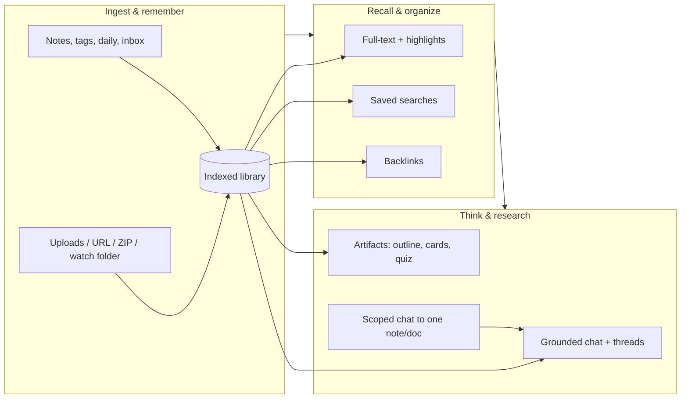
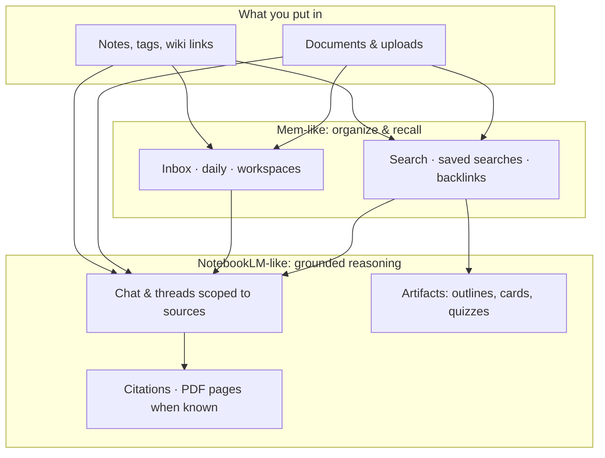

# personal-ai-brain

**A hybrid of [NotebookLM](https://notebooklm.google/) (document-grounded AI) and [Mem.ai](https://mem.ai/) (auto-organizing memory)** — a **personal AI brain** that remembers what you store, understands context across notes and files, and helps you **think** and **research** without sending your library to a hosted multi-tenant product.

| | **NotebookLM-like** | **Mem-like** |
|--|---------------------|--------------|
| **You get** | Chat and answers **grounded** in *your* PDFs, pages, and uploads — with citations, threads, and scoped “focus” on one source | **Capture** (daily notes, inbox, tags), **link** notes (`[[wiki]]`), **backlinks**, saved searches, and quick recall across everything you’ve written |
| **Why it matters** | Less hallucination on *your* material; research and synthesis stay tied to evidence | Less friction between “I wrote this somewhere” and “find it again”; memory feels connected, not a pile of files |

Everything runs **on your machine**: **SQLite**, **FTS5** full-text search, files under **`DATA_DIR`**, optional **local or self-hosted** OpenAI-compatible LLM. One password protects the HTTP API.

---

## How the hybrid fits together

**In one sentence:** you **capture** and **index** like a memory tool, then **query** and **reason** over that same corpus like a research assistant — with **local** data and **your** models.

---

## Benefits (what you actually gain)

- **Trustworthy answers on your sources** — Retrieval + optional embedding rerank; citations point to chunks (and PDF **page** hints when available). Scoped chat limits the model to one note or document when you want precision.
- **A library that stays yours** — No vendor lock-in for raw data: **backup ZIP** (DB + files), **JSON / Markdown export**, and **restore** for round-trips.
- **Memory that scales with you** — Workspaces (“notebooks”), tags, wiki links, **backlinks**, version history on notes, and **saved searches** with filters (type, recency, tag) so old material surfaces when you need it.
- **Faster thinking loops** — **Artifacts** (outline, flashcards, quiz, slide bullets) turn a slice of the library into study or presentation shape; optional **folder watch** drops new files straight into the index.
- **Simple ops model** — Single **`BRAIN_PASSWORD`**, one API process per **`DATA_DIR`**, rate limits and logging for a sane default on a laptop or home server.

---

## Stack & docs

| Piece | Role |
|-------|------|
| **`web/`** | React UI — sources, editor, search, chat |
| **`src/`** | Express API — notes, documents, search, chat, export, artifacts |
| **SQLite + `DATA_DIR`** | Durable notes, document metadata, FTS, uploads |

- **Setup, env, API reference:** **[PERSONAL_AI_BRAIN.md](./PERSONAL_AI_BRAIN.md)**
- **Core backlog (single device):** **[development.md](./development.md)**
- **Multi-device, sync, UI enhancements:** **[future_development.md](./future_development.md)**

Copy **`.env.example`** → **`.env`** at the repo root (one file for API + defaults).

**Dev (API + Vite UI):** from repo root, after `npm install` and `cd web && npm install`, run **`npm run start:all`** — API **http://127.0.0.1:3030**, UI **http://127.0.0.1:5173** (proxies `/api`).

**Production:** **`npm run build && npm start`** serves the built UI from the API port.

---

## Same inputs, two kinds of value

**Idea:** one growing library powers **fast recall** (memory) and **evidence-bound answers** (research) — locally, under your control.
